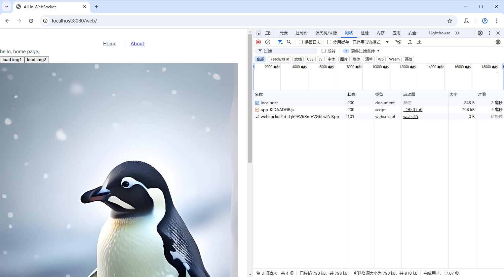
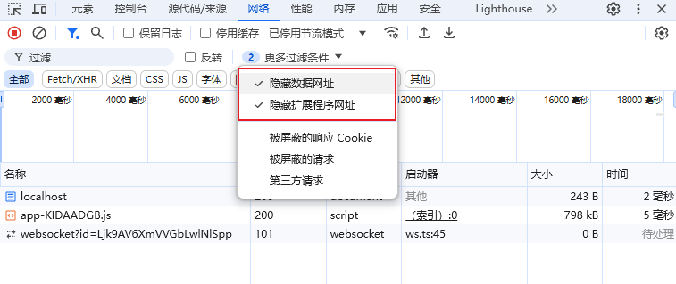
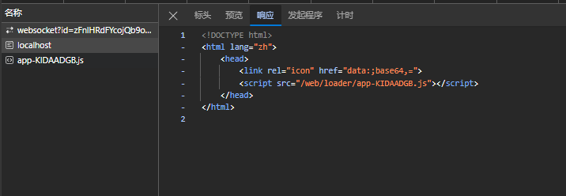
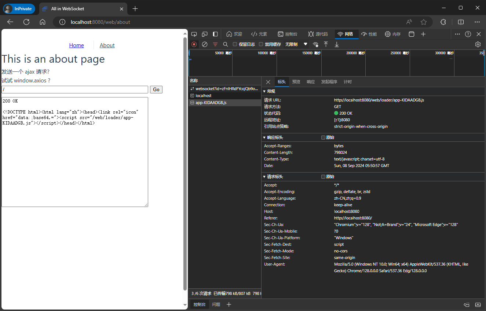
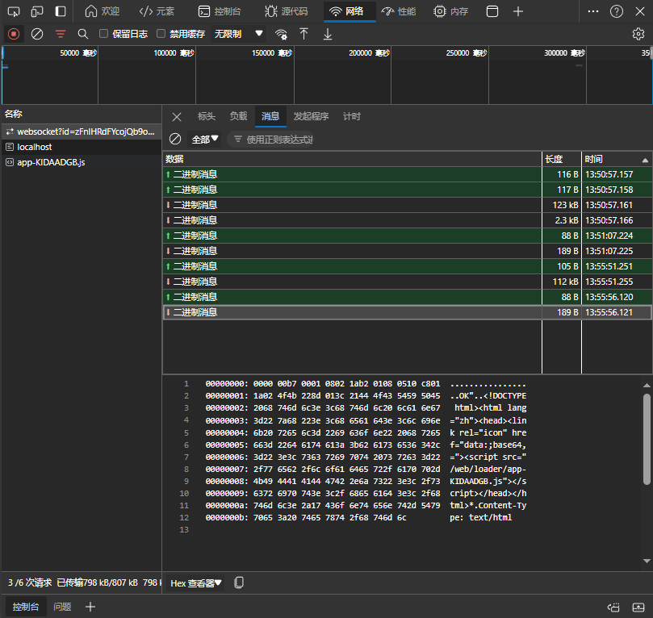
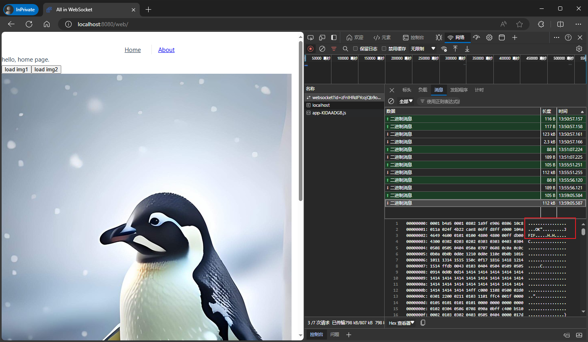

# ALL in WebSocket

这仅仅是一个 技术Demo 可[下载Release](https://github.com/alexsunday/wsweb/releases)体验。

# 功能介绍
整个网站几乎不使用任何标准HTTP请求，不信？可以使用 F12 打开浏览器的开发者工具，切换到 Network 网络标签，再刷新页面，应该可以看到3个请求：

当然，需要隐藏一些 非真实发生的 HTTP 请求，否则会有干扰：

我们简单解析网站所有的 HTTP 请求：
1. 首页 HTML 请求，该请求实质上只有一行 `<script>` 标签

2. 由首页加载的 javascript 加载器，里面有密密麻麻的代码
3. /websocket 请求，这将是整个网站的最后一个请求，后续所有的网络交互，均在此请求内发生

如下图，无论执行多少次 ajax 请求，右侧的网络栏里，均不会再产生新的请求

但仔细检查 websocket 请求，可以看到所有数据途径了该通道：

甚至可以请求图片，右下角的websocket调试窗口中出现的JFIF表明了这是一个jpeg格式的图片：

# 优劣
几乎全是劣势：
1. 无任何 SEO 当然，使用 AW 并不意味着与SEO 的决裂，只是目前为追求极致效果，舍弃了SEO 而已
2. 加载更慢了 明显使用C++实现的浏览器，基础性能肯定好过JS写的加载器
3. 调试不便，舍弃更便捷的 Network 面板而自造轮子，无异于缘木求鱼 买椟还珠！
4. 失去了浏览器内置的缓存支持 如果使用 Cache API 重新实现缓存机制 将有不小的工作量

可能的优势：
1. 做一些聊天室应用时，可能会有用？ 实际上本工程即受 signal app 的启发而完成

# 技术细节

1. 服务端，代码里的 server 文件夹 将收到的任何websocket数据，通过protobuf解析后，组装为一个 http.Request 结构，将该结构送入 gin.RouterGroup::ServeHTTP(http.ResponseWriter, *http.Request) 方法，将 http.ResponseWriter 产生的结果再次通过 websocket 通道将数据发送回客户端；
2. 客户端，web 文件夹，主要逻辑是在连接到服务器后，将任何请求，使用 axios 的 adapter/请求适配器，封装为 protobuf 数据包，并送入websocket通道，留意这里为每个 HTTP 请求都附加了一个 唯一标识，方便在收到返回收据后能正确的唤醒请求发生时的 Promise；
3. 代码中的 loader 文件夹，是一个简单的加载器，用于解析 前端工程产生的 HTML，将 HTML 里的 css，js 文件也通过该通道请求。

# TODO
1. 看看是否还能继续优化 loader 体积
2. gzip 支持
3. 缓存支持
4. 加入 重连 机制与选项 无动作时不重连
